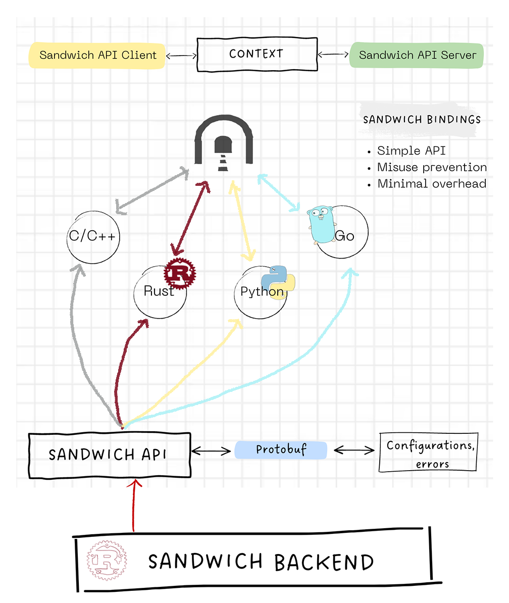
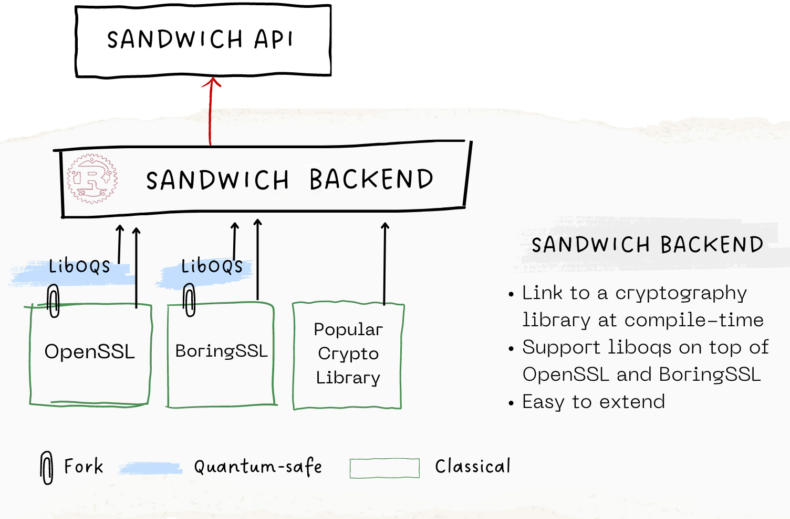

# Sandwich Architecture

## Sandwich **Context** model

Our mental model for Sandwich: **Context**

- Secure connection between Client and Sever **should have context** (i.e: threat model, cryptographic settings)

What does it mean in the implementation?

- Client defines its context, under that context it connects to Servers.
- Server defines its context, under that context it forms Client connections.

With that model in mind, you're good to use Sandwich API.

## Sandwich API

Sandwich API is collections of Sandwich binding to `Go, Python, C/C++` and `Rust` programming languages thanks to `Sandwich Backend`.

At high-level Sandwich API, we provide:

- **Stable** user-friendly APIs in your choice of language
- **Safe** APIs, we prevent the misuse cryptography
- **Share**  configurations, meaningful errors, we use [Protobuf](https://protobuf.dev/) to share **Context** across bindings

What makes Sandwich distinct from other frameworks are the convenience of stability and context portability. Although they are too, promise the safety as in Sandwich.

## Sandwich Backend

In our architecture, `Sandwich Backend` is an abtract layer around cryptography libraries written in Rust, Rust is chosen due to its strict, strongly typed system. In addition, Rust guarantees memory safety without the use of Garbage Collector which make Sandwich confident in cryptographic usage.

At `Sandwich Backend`, we engineer:

- Binding to a subset functionalities of `$TARGET_LIBRARIES` via [Rust automatic binding generations](https://rust-lang.github.io/rust-bindgen/). With FFI produce code, we implement high-level Sandwich API.
- Resolving symbol collision between `$CRYPTO_LIBRARY_A` and `$CRYPTO_LIBRARY_B`, thus Sandwich has the power to work with multiple cryptography libraries easily without touching their source code or build files. (We also contributed to LLVM and [open source our solution](https://github.com/sandbox-quantum/bartleby).

As shown in the picture, by default we support post-quantum cryptography, Sandwich binds to the fork of `OpenSSL, BoringSSl` from [Open Quantum Safe project](https://openquantumsafe.org/) with `liboqs` on top.

On the other hands, Sandwich can bind to official `OpenSSL`, `BoringSSL` and popular `$CRYPTO_LIBRARY` directly with little amount of engineering work, mainly extending backend and resolve symbol collision if there is.

`Sandwich Backend` is considered *unstable*, as it interface with crypto library, changes may happen from libraries we link to, and development work at library level.

While Crypto engineers work at the library level, `Sandwich Backend` encourage contributors and discussions towards misuse prevention, high-level API design and performance improvement.
