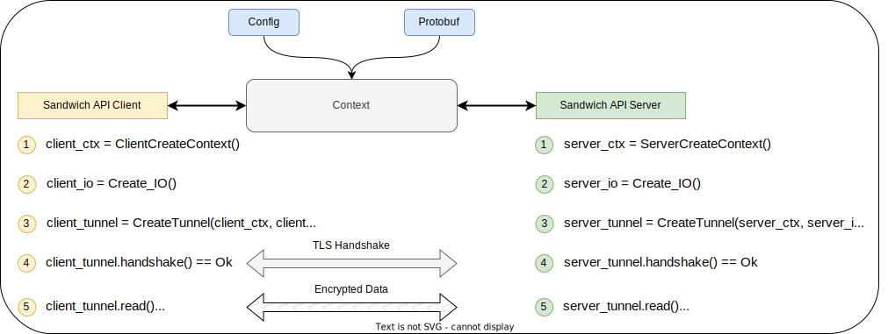

# Examples



In Sandwich, our mental model is **Context**.

A **Context** can be import from _Protobuf_, or user _configurations_.

To perform handshake between Client and Server, in Sandwich we do:

1. Create Context in both Client (`client_ctx`) and Server (`server_ctx`)
2. Create IO as Read and Write buffer (`client_io, server_io`)
3. Create Client and Server Tunnel (`client_tunnel, server_tunnel`) from Context and IO
4. Under the same context, we are ready to initialize tunnel connection:

   - Client and Server performs TLS handshake so both parties can agree on the same shared key
   - Repeat until handshake is success

5. Both Client and Server are ready to transmit and receive data from the TLS established connection.

Here is some sample code to establish TLS connection in ~90 lines of Python:

<!-- TODO(ducnguyen-sb): Write shorter example by loading external protobuf file instead of hardcode options-->

```python
from sandwich import Context, Sandwich, Tunnel
from sandwich.api import EncodingFormat, SandwichAPI
import sandwich.io as SandwichIO

import socket

def create_client_context(s: Sandwich) -> Context:
    """Creates the configuration for the client.

    Returns:
        Configuration for the client.
    """
    conf = SandwichAPI.Configuration()
    conf.impl = SandwichAPI.IMPL_OPENSSL1_1_1_OQS
    conf.client.tls.common_options.kem.append("kyber512")

    cert = conf.client.tls.trusted_certificates.add().static
    cert.data.filename = "testdata/cert.pem"
    cert.format = EncodingFormat.ENCODING_FORMAT_PEM

    return Context(s, conf)


def create_server_context(s: Sandwich) -> Context:
    """Creates the configuration for the server.

    Returns:
        Configuration for the server.
    """
    conf = SandwichAPI.Configuration()
    conf.impl = SandwichAPI.IMPL_OPENSSL1_1_1_OQS

    conf.server.tls.common_options.kem.append("kyber512")
    conf.server.tls.certificate.static.data.filename = "testdata/cert.pem"
    conf.server.tls.certificate.static.format = EncodingFormat.ENCODING_FORMAT_PEM

    conf.server.tls.private_key.static.data.filename = "testdata/key.pem"
    conf.server.tls.private_key.static.format = EncodingFormat.ENCODING_FORMAT_PEM

    return Context(s, conf)

def create_io() -> SandwichIO.IO:
    """Creates IO interface.

    Returns:
        IO object.
    """
    s = socket.socket(family=socket.AF_UNIX, type=SOCK_STREAM)
    return SandwichIO.Socket(s)

if __name__ == "__main__":
    # In Python, we need sandwich handle
    sandwich = Sandwich()

    client_ctx = create_client_context(sandwich)
    client_io = create_io()
    client = Tunnel(client_ctx, client_io)

    server_ctx = create_server_context(sandwich)
    server_io = create_io()
    server = Tunnel(client_ctx, client_io)

    try:
        client.handshake()
    except Exception as e:
        AssertionError(f"expected no error, got {e}")

    try:
        server.handshake()
    except Exception as e:
        AssertionError(f"expected no error, got {e}")

    assert state == client.State.STATE_HANDSHAKE_DONE, "Expected state HANDSHAKE_DONE"
    assert state == server.State.STATE_HANDSHAKE_DONE, "Expected state HANDSHAKE_DONE"

    client_msg = "Ping"
    client.write(client_msg)

    assert server.read(len(client_msg)) == client_msg

    server_msg = "Pong"
    server.write(server_msg)

    assert client.read(len(server_msg)) == server_msg

    client.close()
    server.close()
```
