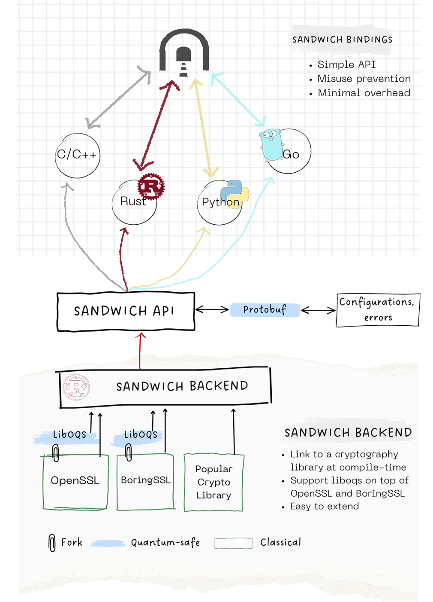

# Sandwich Introduction


## What is Sandwich?

- Sandwich is a **middleware** to interact with cryptographic libraries.
- Sandwich **unifies** cryptographic libraries under the Sandwich API.



## Why use Sandwich instead of `$LIBRARY`?

### Sandwich provides **agility**

Consider these cases:

- If you need to use `$ANOTHER_CRYPTO_LIBRARY` instead of `$CURRENT_CRYPTO_LIBRARY` and worry about API differences?
- If you want have post-quantum cryptography and your `$CURRENT_CRYPTO_LIBRARY` does not have such features?
- If you want to support multiple `$LIBRARIES` instead of a single `$LIBRARY`?

**In all cases above, you don't have to reimplement your code**, the Sandwich API remains unchanged, you just need to point Sandwich to the your new choice of `$CRYPTO_LIBRARY` and recompile.

We have plan to support changing library at run-time on our roadmap.

### Sandwich is a *thin wrapper*

Sandwich is a wrapper around Crypto libraries. Our objectives:

- **Minimal overhead**. You can see our benchmark between Sandwich and direct call to Crypto library [here](TODO).
- **Support multiple languages**. We provide binding to Go, Python, C/C++ via FFI and Rust API.

### Up-to-date

Our update and release cycle occurs at our Github repository.
We ensure to stay on top of performance and security fixes.

### Simple

#### ...to use
Using Sandwich will not collide with your current setup, we support domain separation by preventing symbol name collisions.

To do so, we develop open source tools to encounter problems while developing Sandwich:

- [`Bartleby`](https://github.com/sandbox-quantum/bartleby): Resolve symbols collision between shared crypto libraries. Which means a simple prefix `sandwich_crypto_@version_number` will isolate Sandwich with other libraries.

#### ...to build

`Sandwich Backend` links to well-tested Cryptography libraries (e.g OpenSSL, BoringSSL). `Sandwich API` provides safe, high-level abstraction on top of `Sandwich Backend` to other programming languages.

Our build process is wrapped in Bazel build, which compiles the Sandwich cores and Cryptography libraries, plus all the bindings.

`Bazel` provides fast and parallel approaches, it's also support multiple platforms by predefined `Bazel rules`.
We think Bazel build system enhances build process experience for developers.

With Bazel, we simplify the build process to a few commands:

```
bazelisk build ... # Build everything
bazelisk test ...  # Test everything
```

# License

Sandwich is under [Apache 2.0 License](https://apache.org/licenses/LICENSE-2.0).

# Disclamer

The software and documentation are provided "as is" and SandboxAQ hereby disclaims all warranties, whether express, implied, statutory, or otherwise.
SandboxAQ specifically disclaims, without limitation, all implied warranties of merchantability, fitness for a particular purpose, title, and non-infringement, and all warranties arising from course of dealing, usage, or trade practice.
SandboxAQ makes no warranty of any kind that the software and documentation, or any products or results of the use thereof, will meet any person's requirements, operate without interruption, achieve any intended result, be compatible or work with any software, system or other services, or be secure, accurate, complete, free of harmful code, or error free.
